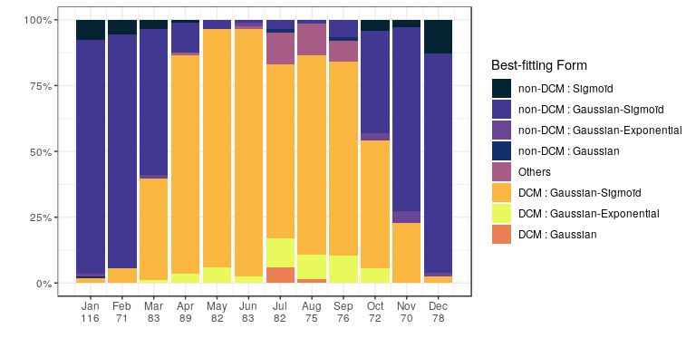
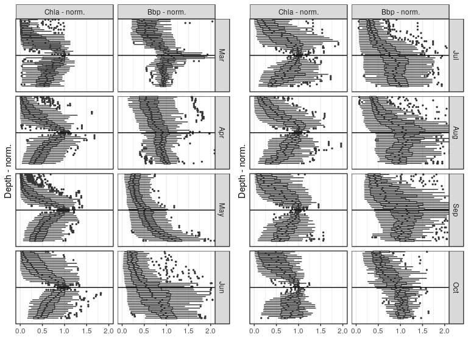
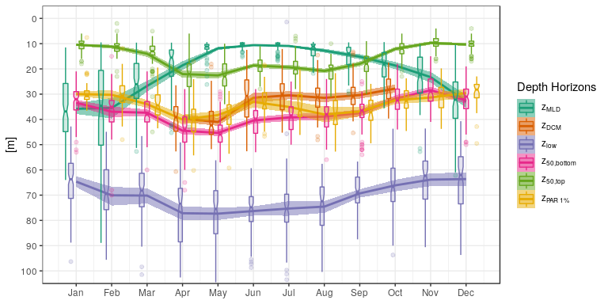
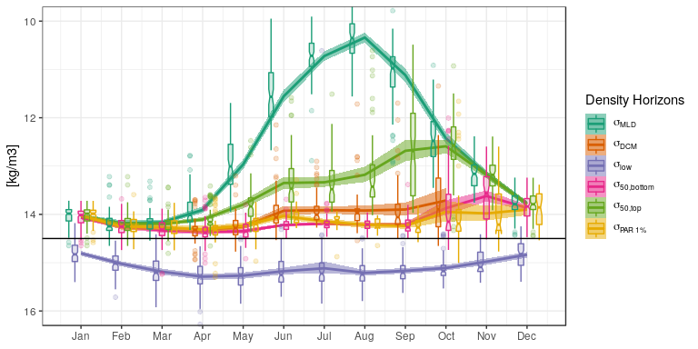
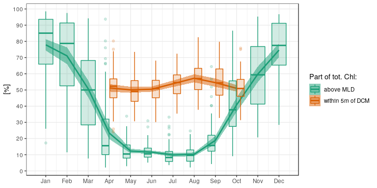
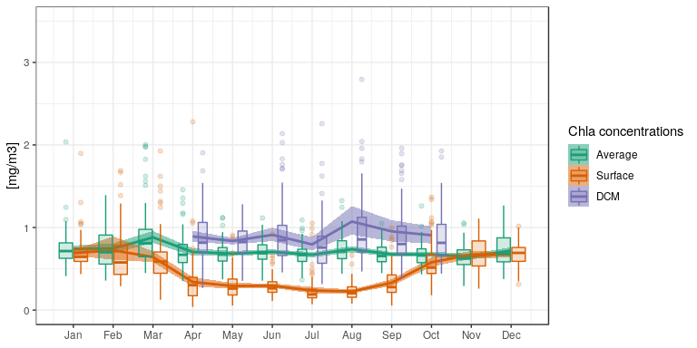
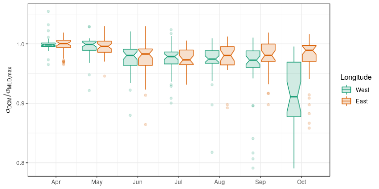
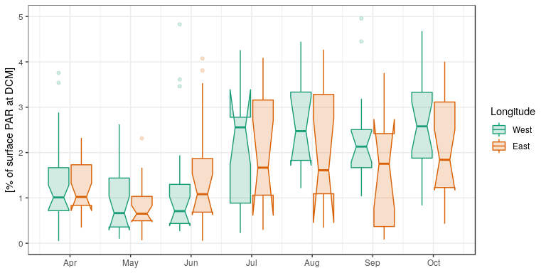
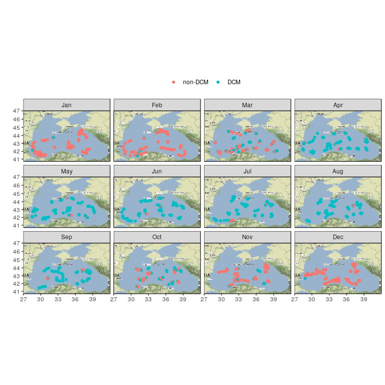
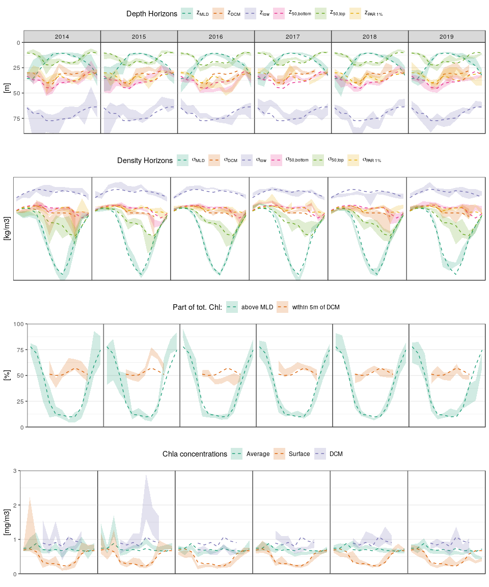

DCM\_investigation
================
MAST
February 20, 2020

-   [Evolution of the Black Sea Deep Chlorophyll Maximum](#evolution-of-the-black-sea-deep-chlorophyll-maximum)
-   [Seasonal Time-Series](#seasonal-time-series)
-   [Back Scattering Validation of the DCM](#back-scattering-validation-of-the-dcm)
-   [Depth horizons](#depth-horizons)
    -   [Density Horizons](#density-horizons)
    -   [Vertical distribution of the CHL content](#vertical-distribution-of-the-chl-content)
    -   [Concentrations](#concentrations)
    -   [Navarro's Ratio](#navarros-ratio)
    -   [and what about light at DCM ?](#and-what-about-light-at-dcm)
-   [Potential Additional sections.](#potential-additional-sections.)
    -   [Spatial](#spatial)
    -   [Inter-annual variability.](#inter-annual-variability.)

Evolution of the Black Sea Deep Chlorophyll Maximum
===================================================



Seasonal Time-Series
====================

Back Scattering Validation of the DCM
=====================================

    ## Loading required package: reshape2



Depth horizons
==============

    ## notch went outside hinges. Try setting notch=FALSE.



Density Horizons
----------------

    ## notch went outside hinges. Try setting notch=FALSE.
    ## notch went outside hinges. Try setting notch=FALSE.



Vertical distribution of the CHL content
----------------------------------------



Concentrations
--------------



Navarro's Ratio
---------------

``` r
require(scales)

MLDdf_info2 <- ddply(tmp_fitco, .(year,platform), summarize,
                maxMLD = max(MLD, na.rm = T),
                sigmaMaxMLD = max(sigmaMLD, na.rm = T))

sigma_ratio2 <- ddply(tmp_fitco, .(platform, juld), mutate,
   sigmaMaxMLD = MLDdf_info2$sigmaMaxMLD[which((MLDdf_info2$year == unique(year))
                                              & (MLDdf_info2$platform == unique(platform)))],
   ratio = sigmaMAX/sigmaMaxMLD)
```



and what about light at DCM ?
-----------------------------

    ## notch went outside hinges. Try setting notch=FALSE.
    ## notch went outside hinges. Try setting notch=FALSE.
    ## notch went outside hinges. Try setting notch=FALSE.
    ## notch went outside hinges. Try setting notch=FALSE.
    ## notch went outside hinges. Try setting notch=FALSE.
    ## notch went outside hinges. Try setting notch=FALSE.
    ## notch went outside hinges. Try setting notch=FALSE.
    ## notch went outside hinges. Try setting notch=FALSE.
    ## notch went outside hinges. Try setting notch=FALSE.
    ## notch went outside hinges. Try setting notch=FALSE.
    ## notch went outside hinges. Try setting notch=FALSE.



Potential Additional sections.
==============================

Spatial
-------

    ## Loading required package: ggmap

    ## Google's Terms of Service: https://cloud.google.com/maps-platform/terms/.

    ## Please cite ggmap if you use it! See citation("ggmap") for details.

    ## Source : http://tile.stamen.com/terrain/6/36/22.png

    ## Source : http://tile.stamen.com/terrain/6/37/22.png

    ## Source : http://tile.stamen.com/terrain/6/38/22.png

    ## Source : http://tile.stamen.com/terrain/6/39/22.png

    ## Source : http://tile.stamen.com/terrain/6/36/23.png

    ## Source : http://tile.stamen.com/terrain/6/37/23.png

    ## Source : http://tile.stamen.com/terrain/6/38/23.png

    ## Source : http://tile.stamen.com/terrain/6/39/23.png

    ## Source : http://tile.stamen.com/terrain/6/36/24.png

    ## Source : http://tile.stamen.com/terrain/6/37/24.png

    ## Source : http://tile.stamen.com/terrain/6/38/24.png

    ## Source : http://tile.stamen.com/terrain/6/39/24.png

    ## Scale for 'x' is already present. Adding another scale for 'x', which will
    ## replace the existing scale.

    ## Scale for 'y' is already present. Adding another scale for 'y', which will
    ## replace the existing scale.



Inter-annual variability.
-------------------------

Here we repeat all plots made above, but with single lines marking interannual variability.


