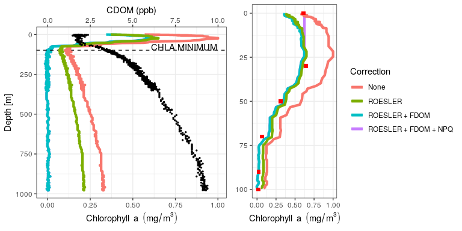
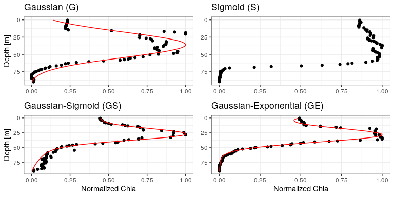

Article - Figures
================
Ricour Florian
June 24 2020

-   [Load a bunch of data previously computed](#load-a-bunch-of-data-previously-computed)
-   [Chla correction with Raw + Roesler + FDOM + NPQ](#chla-correction-with-raw-roesler-fdom-npq)
-   [Profile shapes + fitted curves](#profile-shapes-fitted-curves)

Load a bunch of data previously computed
----------------------------------------

``` r
load(file='DataPaper.RData')
```

Chla correction with Raw + Roesler + FDOM + NPQ
-----------------------------------------------



Profile shapes + fitted curves
==============================


